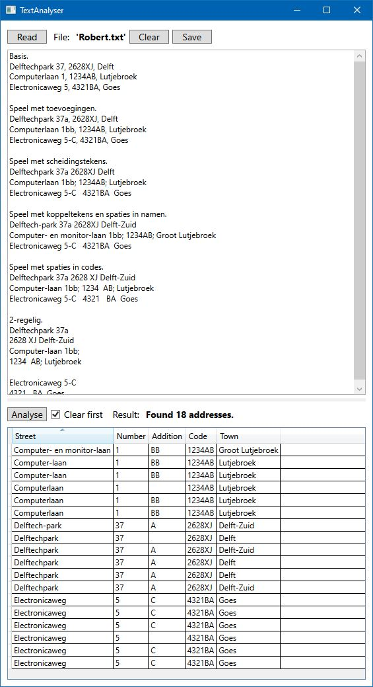

## TextAnalyser

#### Description
Working desktop application for test and demo purpose based on WPF and C#. 
Core functionality is extraction of Dutch addresses from texts by means of regular expressions.

#### Aspects
* WPF.
* C# + XAML.
* MVVM.
* Command based enablement.
* Single language resources.
* Basic styling.
* Regular expressions.

#### Basic usage steps
* Read a text file. Some examples included.
* Optionally edit the text in the upper view for experimentation.
* Optionally save the result for later use by the 'Save' button..
* Press 'Analyse' to see result of analysis.
* Optionally keep previous results for comparison, by deselecting 'Clear first'.
* Optionally sort the result on some column.
* Optionally change the window dimensions.
* Optionally change the ration between the 2 views.